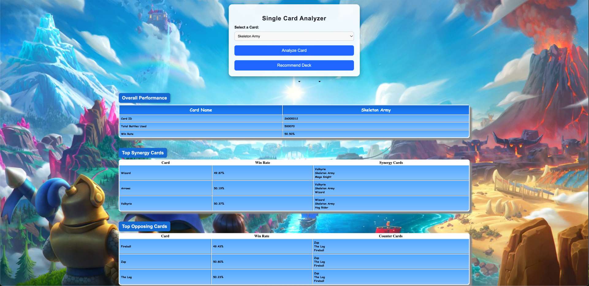
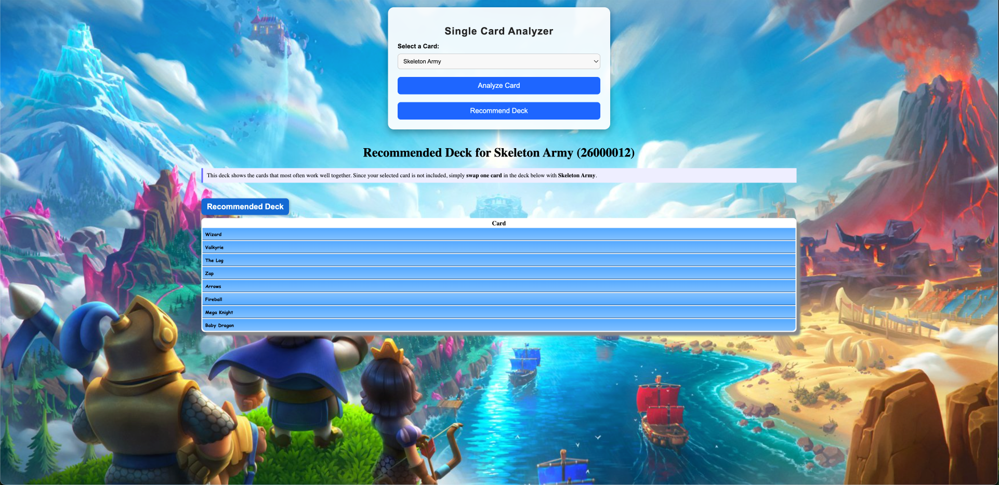
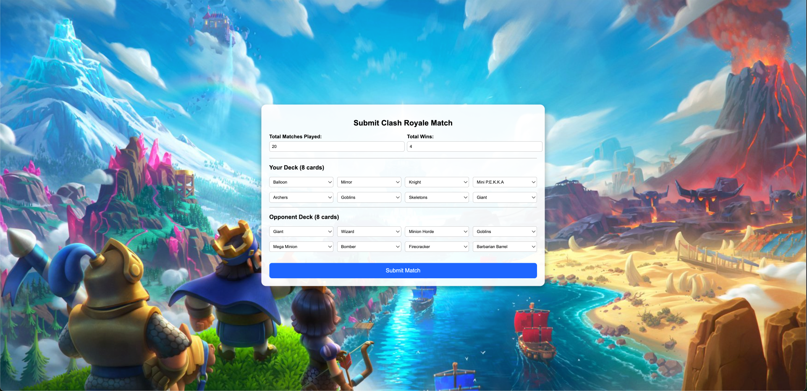

# Final Project

All components of my Clash Royale Big Data Analytics System are deployed across the two course servers. Below is a clear guide to where every part of the project is located.

- Repo Link: https://github.com/luwop/app
---

## Hadoop / EMR Cluster (Batch and Speed Layer)

All Hive, HBase, and Spark scripts — including:

- Hive table creation `.hql` files
- ORC table creation scripts
- Batch aggregation jobs
- HBase schema and loading scripts
- Machine learning deck recommender (`DeckRecommender.scala`)
- Spark Streaming job and JAR for ingesting Kafka events
- Supporting datasets and logs

are stored in my directory: **/home/hadoop/grlewis/**

TThis folder contains all ETL code, analytics scripts, machine learning logic, and the speed-layer streaming code.

---

## Web Server (Application Layer)

The complete Node.js application, including:

- Express web server
- Kafka producer for match submissions
- Mustache templates
- Static HTML, CSS, and JavaScript files (including `index.html` and `match.html`)

is located on the web server at: **/home/ec2-user/app/**


This directory contains the full frontend and backend code for the web application.

---

## Web Application URLs

If accessible through the course web server, the application can be viewed at: http://ec2-52-20-203-80.compute-1.amazonaws.com:3015/index.html


and the match submission page: http://ec2-52-20-203-80.compute-1.amazonaws.com:3015/match.html

If these URLs are not externally reachable, all application code and configuration details are included in this repository and in the server directories listed above.

---

## Additional Notes

- Logs for the Kafka streaming job are included in the root of the repository.
- The folder `grlewis_battle_events/` contains the Spark Streaming JAR and related files used for ingesting match events.

# Clash Royale Card Analytics System

**Clash Royale** is a mobile strategy game where two players battle using decks of 8 cards.  
Each card represents a troop, building, or spell. Card performance depends on:

- **Synergies** — which cards it is paired with
- **Counters** — what it faces in battle

This project analyzes real match data from **Season 18** to:

- Compute card-level statistics
- Recommend strong deck combinations
- Simulate new match submissions through a streaming pipeline

## APP Images

Below are screenshots of the Clash Royale Analytics Web Application:

| | |
|---|---|
| **App Screenshot 1** | **App Screenshot 2** |
|  |  |
| **App Screenshot 3** | **App Screenshot 4** |
|  |  |

---

## Logs Included

A full log output is included in:

```text
Here are logs of the request for card statistics:

Kafka connection established.
GET /stats.html { card_id: '26000012' }
Fetching stats for card: 26000012
Stats found. Processing relationships...
Fetching secondary card: 26000017
Fetching secondary card: 26000011
Fetching secondary card: 28000001
Synergies processed.
Fetching secondary card: 28000011
Fetching secondary card: 28000008
Fetching secondary card: 28000000
Counters processed.
Rendering stats page.


Here are the logs of requests for deck summaries:

Rendering stats page.
GET /recommend.html { card_id: '26000012' }
Fetching recommended deck for: 26000012
Deck found. Rendering page.


Manual upload to Kafka

GET /submit-match {
  matches: '20',
  wins: '4',
  player1: '26000006',
  player2: '28000006',
  player3: '26000000',
  player4: '26000018',
  player5: '26000001',
  player6: '26000002',
  player7: '26000010',
  player8: '26000003',
  opp1: '26000003',
  opp2: '26000017',
  opp3: '26000022',
  opp4: '26000002',
  opp5: '26000039',
  opp6: '26000013',
  opp7: '26000064',
  opp8: '28000015'
}
Event constructed: {
  timestamp: 1765414701723,
  matches: 20,
  wins: 4,
  player_cards: [
    26000006, 28000006,
    26000000, 26000018,
    26000001, 26000002,
    26000010, 26000003
  ],
  opponent_cards: [
    26000003, 26000017,
    26000022, 26000002,
    26000039, 26000013,
    26000064, 28000015
  ]
}
Sending event to Kafka...
Kafka message sent successfully.

```


## Data Source

The raw battle data used in this project comes from a publicly available Kaggle dataset:

**Clash Royale Season 18 Dataset**  
https://www.kaggle.com/datasets/bwandowando/clash-royale-season-18-dec-0320-dataset

All data was provided in CSV format, including:

- Full lists of battles
- Player win conditions
- Card usage information
- The full Clash Royale master card list

The original dataset contained **more than 30 million rows**.  
A subset of **about 1 million battles** was used for efficiency, which still produced approximately **17 million card event rows** after expansion.

## Data Processing

A **card event** represents a single card appearing in a player’s 8-card deck during a match.  
Because each battle contains **16 total cards** (8 from the winner, 8 from the loser), the dataset expands significantly.

From these CSVs, a structured dataset was created and used to compute:

### Core Card Statistics
- Total appearances across all battles
- Number of wins and losses
- Win rate
- Average elixir when winning
- Average elixir when losing
- Overall average elixir

### Relationship Metrics
- **Top three synergy cards** — commonly paired together in winning decks
- **Top three counter cards** — cards that frequently defeat this card

The batch computations were performed in **Hive**, using **ORC tables** for optimized storage.  
Final aggregated card statistics were loaded into **HBase**, which serves as the fast lookup layer for the web application.

## Recommended Decks (Batch ML Logic)

Using the battles dataset, decks were analyzed to identify strong card combinations.  
The system computes:

- For each card, the **top 8 most frequently paired cards** across winning decks
- These 8 cards form the **recommended deck**

These results are written to an **HBase** table, enabling fast lookup from the application.

Note:  
The recommended deck does **not** include the analyzed card itself.  
Users are instructed to replace **one** of the suggested cards with the selected card to form a complete, valid deck.

## Application Layer

The application is built using:

- **Node.js + Express.js**
- **HBase** client for reading aggregated statistics
- **Mustache** templates for rendering output
- Static **HTML/CSS** for the user interface
- A small local file (`cards.json`) used to map card IDs to readable card names

---

## Single Card Analyzer

This page allows the user to select a card and view:

- Total usage
- Win rate
- Synergy list (with win rates and further synergies)
- Counter list (with win rates and further counters)
- Recommended deck combinations

All values are retrieved directly from **HBase**.

---

## Recommended Deck Page

Based on precomputed deck data in HBase, users can retrieve:

- A list of the **top 8 recommended partner cards** for any selected card
- Instructions to replace **one** of the suggested cards with the selected card to complete the deck

## Match Submission (User Event Ingestion)

A separate form allows users to manually submit match results by entering:

- Number of matches played
- Number of wins
- The player's 8 cards
- The opponent's 8 cards

The form validates that:

- Wins do not exceed matches
- Values cannot be negative
- The player's deck does not contain duplicates

Submitted matches are sent as JSON events to a Kafka topic: **grlewis_clash_events**

- This simulates live collection of battle data.

## Speed Layer (Streaming Layer)

The speed layer uses:

- **Kafka** for ingestion
- **Spark Streaming** (planned) for real-time updates

The streaming job will eventually:

- Consume events from the Kafka topic
- Incrementally update card statistics
- Recompute synergy and counter relationships
- Write updates back into HBase

This allows analytics to **evolve live** as new matches are submitted.

## System Architecture Overview

This project demonstrates a complete **Big Data architecture** similar to those used in competitive online games.

---

### Batch Layer
- **Hive ORC tables**
- Large-scale offline computations
- Aggregation of card statistics and pair frequencies

---

### Machine Learning Layer
- Frequency-based co-occurrence analysis
- Ranking of synergy cards
- Data-driven deck recommendation generation
- Export of recommended decks to **HBase** for fast serving

---

### Serving Layer
- **HBase**
- Optimized for low-latency lookups
- Stores both card statistics and recommended deck results

---

### Speed Layer
- **Kafka** for ingestion of new matches
- Future **Spark Streaming** job for real-time updates

---

### Application Layer
- **Node.js** web service
- **Mustache**-based rendering of analytics
- Static **HTML** pages for card selection, results, and match submission

---

Together, these components form an **end-to-end analytics pipeline** capable of processing millions of events and providing instant lookup for card statistics, synergies, counters, and recommended decks.


